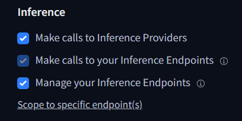
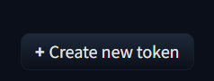
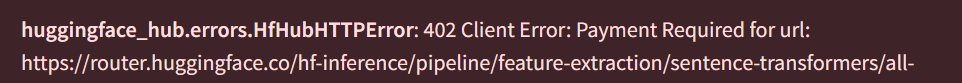
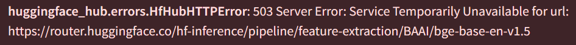

# RAG App

### Conda Environment Setup and Installation

Follow these steps to set up and run the program using `conda` and `pip`:

## 1. Create a Conda Environment with Python 3.11

```bash
conda create --name project-name python=3.11
```

Replace `project-name` with the desired name for your environment.

## 2. Activate the Conda Environment

Activate the environment you just created:

```bash
conda activate project-name
```

## 3. Install the Required Dependencies

Navigate to your project folder in console.
Install the dependencies using `pip`:

```bash
pip install -r requirements.txt
```

---

4. **Create a Hugging Face API Token**:

   To interact with Hugging Face models and APIs, you need an API token. Follow these steps to create one:
   
   - Go to [Hugging Face](https://huggingface.co/).
   - Log in or create a new account if you don’t have one.
   - Once logged in, click on your profile icon at the top-right corner of the page and select **Settings**.
   - 
   - In the **Access Tokens** section, click on **New Token**.
   - Choose those access fields
   - 
   - Click **Create** to generate your token.
   - 
   - Copy the token to your clipboard.

5. **Add Your API Token**:

   Ensure you have a `.env` file in your project folder with the following line:
   ```text
   HUGGINGFACEHUB_API_TOKEN=youraccesstoken
   ```
   Replace `youraccesstoken` with the Hugging Face token you just generated.

6. **Run the Application**:
   To start the application, run:
   ```bash
   streamlit run app.py
   ```

   Reminder: you have to be in your project directory and have envirnoment activated with dependencies installed

### My Approach

## Models Used

- **Model for Embeddings**: `BAAI/bge-base-en-v1.5`
- **LLM (Large Language Model)**: `HuggingFaceH4/zephyr-7b-beta`
- **Similarity Model for Domain Classification**: `sentence-transformers/all-MiniLM-L6-v2` for domain similarity checks

### Document Classification: Concerts/Tours Domain

To classify if an ingested document belongs to the "concerts/tours" domain, I use a two-step process:

1. **Keyword Search**: I first apply basic NLP preprocessing to the document (stop words removal, lemmatization, converting to lowercase, and tokenization) to clean the text. Afterward, I perform a **keyword search** using a `keywords.txt` file, which contains keywords scraped from texts related to 2025 concert tours.

   - The threshold for classification is adjustable via a slider that determines how many keywords must be found in the text for classification to happen.

2. **Embedding-based Similarity**: If the keyword search doesn't provide clear classification, I fall back on the embedding model to compare the document with a predefined domain description:
   ```text
   This document is about upcoming concert tours, musical performances, venues, artists, bands, tickets, live music events, and music festivals in 2025-2026.
   ```
   Using the `sentence-transformers/all-MiniLM-L6-v2` model, I calculate the **cosine similarity** between the document and the domain description. If the similarity score exceeds a threshold (e.g., `threshold_similarity = 0.5`), the document is classified into the concerts/tours domain.

### Text Summarization

The summarization uses **TF-IDF** (Term Frequency-Inverse Document Frequency) scores to identify important words in the text, following these steps:

1. **Preprocessing**: The text is cleaned using lower case, stop word removal, lemmatization, and tokenization
2. **TF-IDF Calculation**: The cleaned text is converted into a TF-IDF matrix to assess the importance of each word.
3. **Threshold-based Summarization**: A threshold is applied based on the TF-IDF scores to filter out less important words. Users can adjust the threshold using a slider. If too few words meet the threshold, the function adds the highest-scoring words to ensure a more complete summary.
4. **Summary Construction**: The summary is formed by joining the selected words from the original text based on the computed scores.

The slider allows users to fine-tune the summary length, offering more control over how much content is included in the final summary.

---

### Retrieval Process

1. **FAISS database vectorstore**: 
   After the text is summarized using TF-IDF, the summarized chunks are stored in a **FAISS database vectorstore**. These chunks are indexed as vectors for efficient similarity searches.

2. **Prompt Template**: 
   When a user asks a question, the system uses a **prompt template** to structure the response. The template includes instructions for the assistant to:
   - Combine relevant information across all chunks.
   - Use a basic calendar to interpret dates into seasons (Spring, Summer, Autumn, Winter).
   - Only use the information provided in the context, without bringing in external knowledge.
   
   The prompt format ensures the assistant answers questions based on the summarized content and applies the season calendar for date interpretation.

3. **Retriever**: 
   The system uses a **retriever** to fetch the most relevant chunks of information from the FAISS vectorstore. The retriever performs a **similarity search** to find the top 4 most relevant chunks based on the user's query.

This process ensures that the assistant answers questions based on the summarized context, using only the most relevant information retrieved from the vectorstore.


### Error Handling and API Limitations

While using the Hugging Face API for embeddings, you might encounter a couple of potential issues:

1. **Payment Issues**  
   Sometimes, API calls might fail due to payment-related issues. If this happens, create new HuggingFace account and a new token and put it in .env file. After that reload your program.
   

2. **Other API Errors**  
   Random errors can occasionally occur with the embeddings API. This type of error is often temporary and can be resolved by **rewording your prompt**. For example, changing the phrasing of your request can sometimes help bypass the error. If error occurs on file ingestion part, just change summary parameter on slider and it will work on new text.
   

---


   
### Possible upgrades with more time and resources

1. **Classification**:
   - Instead of using **TF-IDF** for domain classification (concert vs non-concert), I could have trained a **Neural Network (NN)** or other deep learning models to classify the tokenized and embedded text into predefined labels. However, this would require a labeled dataset for supervised learning, which wasn't available.

   - Another option would have been to implement **Zero-shot Classification** for determining if the document is related to concerts or not. This approach leverages models like Hugging Face's `zero-shot-classification` pipeline to classify text without the need for labeled data.

2. **Summarization**:
   - While I used **TF-IDF** for summarization, another option could have been to use the **facebook/bart-large-cnn** model, which is specifically designed for text summarization. However, this model would have needed fine-tuning as it tends to forget important facts in long documents, making it less reliable without additional training.

3. **Chunk Retrieval**:
   - I could have implemented **MMN (Masked Multi-head Attention Networks)** for chunk retrieval to avoid selecting chunks with redundant context. However, for smaller documents, I found this unnecessary, as the performance gain wouldn't justify the complexity.

4. **Text Chunking**:
   - Another possibility would have been to create a **semantic text chunk splitter** that splits the text into meaningful chunks based on significant changes in semantic meaning between sentences. This would allow for more context-aware chunking, but was deemed unnecessary due to the nature of the documents being processed.


